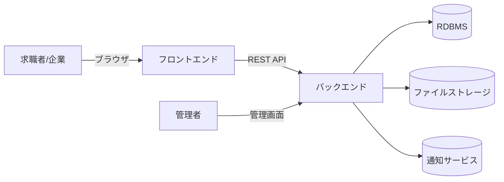

# システム構成図

```mermaid
flowchart LR
    User[求職者/企業] -->|ブラウザ| FE[フロントエンド]
    FE -->|REST API| BE[バックエンド]
    BE --> DB[(RDBMS)]
    BE --> FS[(ファイルストレージ)]
    BE --> NS[(通知サービス)]
    Admin[管理者] -->|管理画面| BE
```

フロントエンドはSPAを想定し、バックエンドAPIと通信します。バックエンドは認証・求人・応募・メッセージなどの各機能を提供し、データベースおよびファイルストレージと連携します。通知サービスはメールやプッシュ通知を送信します。
